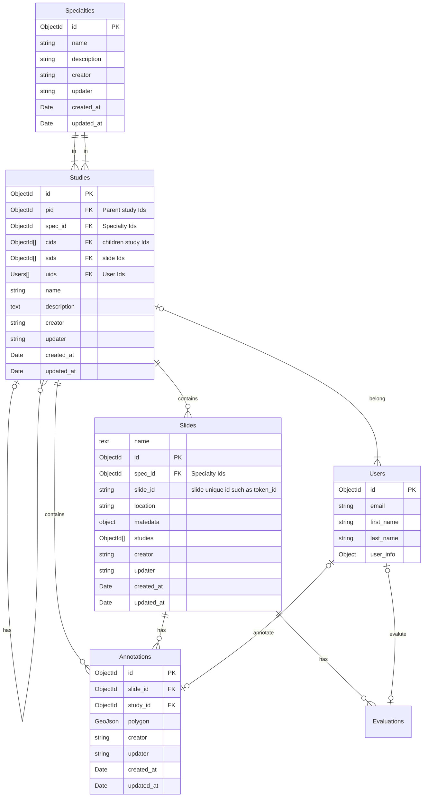

# Study Management for CaMicroscope
## Entities Definition

### Study

**Definition:**
A study is a collection of slides or annotations, in which users/pathologists examine and analyze WSI or ROI to make annotations and/or evaluations for a medical specialty. The studies could be assigned to multiple users/pathologists. The studies could be a hierarchical structure.

**functionalities:**
1. create a studies
2. read studies
3. update studies
4. delete studies
5. update the type of studies
6. update the specialty of studies
7. add slides
8. remove slides
10. add annotations
11. remove annotations
12. add users
13. remove users
14. move studies to (hierarchical structure)
15. search studies based on some conditionals

Only a study that has slides or annotations could be assigned to users/pathologies

 
### Slide

**Definition:**
a slide is a whole-slide image (also known as a virtual slide).

Support format:
* Aperio (.svs, .tif) 
* DICOM (.dcm) 
* Hamamatsu (.vms, .vmu, .ndpi) 
* Leica (.scn) 
* MIRAX (.mrxs) 
* Philips (.tiff) 
* Sakura (.svslide) 
* Trestle (.tif) 
* Ventana (.bif, .tif)
* Generic tiled TIFF (.tif)

**Schema:**

**functionalities:**
1. upload a slide
2. upload a slide bundle
3. read the matedata of a slide
4. update the matedata of a slide
5. rename a slide
6. read a slide as tiles
7. remove a slide

### Annotation
    
**Definition:**
An annotation is 
**Schema:**

**functionalities:**

### Evaluation

**Definition:**

**Schema:**

**functionalities:**

### Specialty

**Definition:**

**Schema:**

**functionalities:**

### User
**Definition:** 

**Schema:**

**functionalities:**
1. create users
2. read user profile
3. update user profile
4. delete user

### ER Diagram

Studies:

