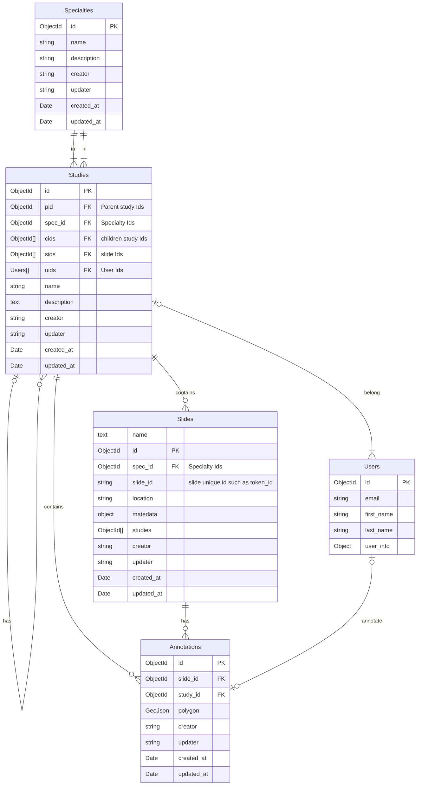

# docs
Documentation website for caMicroscope

```mermaid
erDiagram
    Studies {
        ObjectId id PK
        ObjectId pid FK "Parent study Ids"
        ObjectId spec_id FK "Specialty Ids"
        ObjectId[] cids FK "children study Ids"
        ObjectId[] sids FK "slide Ids"
        Users[] uids FK  "User Ids"
        string name
        text description
        
        string creator
        string updater
        Date created_at
        Date updated_at
    }

    Slides {
        text name
        ObjectId id PK
        ObjectId spec_id FK "Specialty Ids"
        string slide_id "slide unique id such as token_id"
        
        string location 
        object matedata
        ObjectId[] studies
        string creator
        string updater
        Date created_at
        Date updated_at
        
    }

    Annotations {
        ObjectId id PK
        ObjectId slide_id FK
        ObjectId study_id FK 
        GeoJson polygon
        string creator
        string updater
        Date created_at
        Date updated_at  

    }

    Specialties {
        ObjectId id PK
        string name
        string description
        string creator
        string updater
        Date created_at
        Date updated_at
    }

    Users {
        ObjectId id PK
        string email
        string first_name
        string last_name
        Object user_info
    }

    Studies o|--o{ Studies : has
    Studies ||--o{ Slides : contains
    Studies ||--o{ Annotations : contains
    Studies o|--|{ Users : belong
    Specialties ||--|{Studies  : in
    Specialties ||--|{Studies  : in
    Slides ||--o{ Annotations : has
    Users  o|--o| Annotations: annotate
```
Studies:

